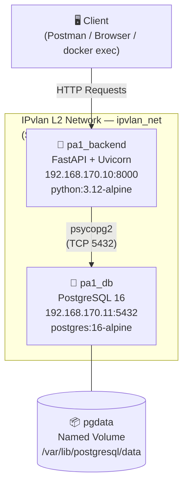
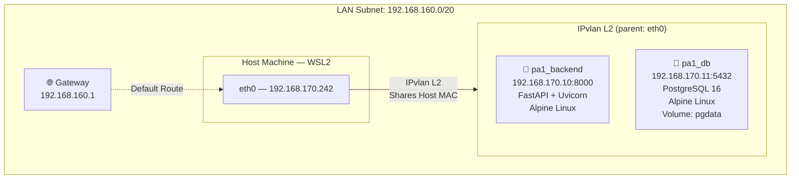
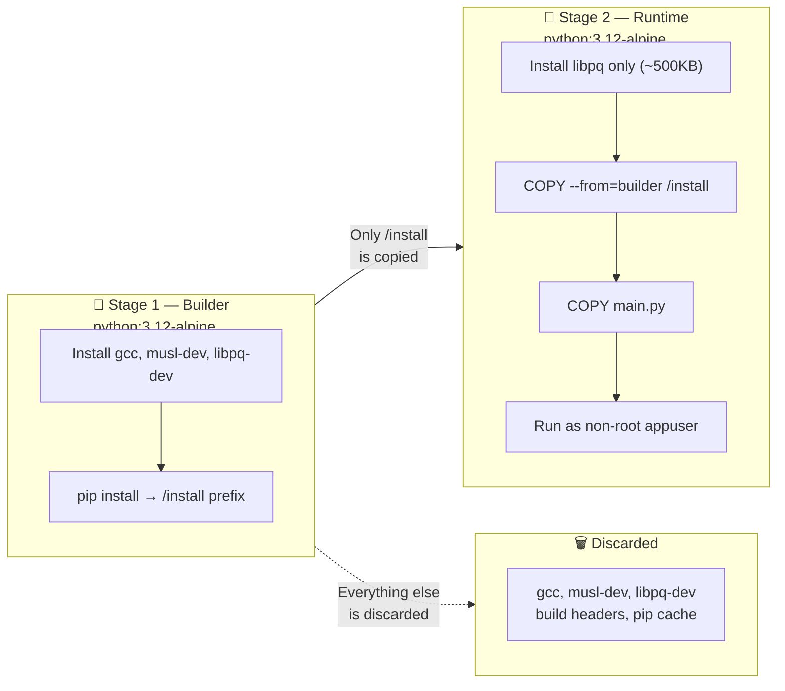
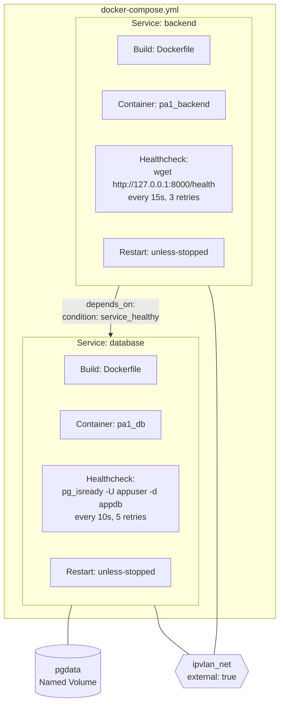
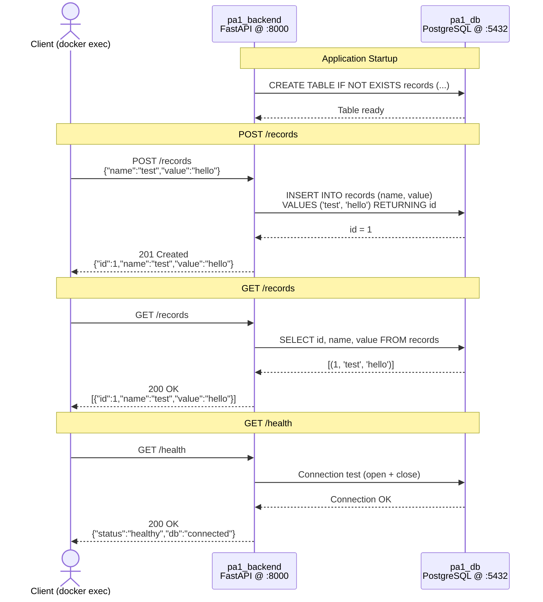

# Project Assignment 1 — Report
## Containerized Web Application with PostgreSQL using Docker Compose and IPvlan

**Name:** Ujjawal Gautam  
**Date:** March 2026  
**Stack:** FastAPI + PostgreSQL + Docker Compose + IPvlan (L2)

[← Back to README](./README.md)

---

## Table of Contents

- [1. Architecture Overview](#1-architecture-overview)
- [2. Network Design](#2-network-design)
- [3. Build Optimization](#3-build-optimization)
- [4. Docker Compose Design](#4-docker-compose-design)
- [5. Request Lifecycle](#5-request-lifecycle)
- [6. Functional Requirements Verification](#6-functional-requirements-verification)
- [7. Conclusion](#7-conclusion)

---

## 1. Architecture Overview

The system follows a two-tier containerized architecture:



Both containers are attached to a manually created IPvlan (L2 mode) network named `ipvlan_net`, with statically assigned IPs from the host's LAN subnet (`192.168.160.0/20`).

---

## 2. Network Design

### Network Creation Command

```bash
docker network create \
  -d ipvlan \
  --subnet=192.168.160.0/20 \
  --gateway=192.168.160.1 \
  -o ipvlan_mode=l2 \
  -o parent=eth0 \
  ipvlan_net
```

### Network Topology



### IPvlan vs Macvlan Comparison

| Feature | IPvlan (L2) | Macvlan |
|---|---|---|
| MAC address per container | No — shares host MAC | Yes — unique MAC per container |
| ARP handling | Host handles ARP | Each container responds to ARP |
| Switch configuration | No changes needed | May need promiscuous mode |
| Performance | Slightly better (no ARP overhead) | Slightly lower |
| Host-to-container isolation | Yes — host cannot reach containers | Yes — host cannot reach containers |
| DHCP server compatibility | More compatible | May conflict with DHCP |
| Use case | Environments where MAC spoofing is blocked (cloud VMs, Hyper-V) | Physical LAN with full L2 access |
| WSL2 compatibility | Better — Hyper-V blocks MAC spoofing | Problematic — Hyper-V blocks promiscuous mode |

**Why IPvlan was chosen:** This project runs on WSL2 (Hyper-V backend). Hyper-V virtual switches block MAC address spoofing by default, which makes Macvlan unreliable in this environment. IPvlan shares the host's MAC address and avoids this restriction, making it the correct choice for WSL2-based deployments.

### Host Isolation Issue (IPvlan / Macvlan)

A well-known limitation of both IPvlan and Macvlan is **host-to-container isolation**: the host machine cannot directly communicate with containers on the virtual network. This occurs because the virtual network interface (`eth0` as parent) bypasses the host's network stack at the kernel level.

**In this project:** WSL2 acts as the host. Containers at `192.168.170.10` and `192.168.170.11` are not reachable via `curl` from within WSL2. All API testing was done using `docker exec` to enter the container and test from `127.0.0.1` (localhost within the container), which works correctly because Uvicorn binds to `0.0.0.0`.

**Workaround in production:** A bridge network can be added alongside the ipvlan network for host access, or an Nginx reverse proxy container on a bridge network can forward traffic into the ipvlan containers.

---

## 3. Build Optimization

### Multi-Stage Build Strategy

The application `Dockerfile` (at the project root) uses a **two-stage build**:



**Stage 1 — Builder (`python:3.12-alpine`):**
- Installs `gcc`, `musl-dev`, `libpq-dev` (build-time only tools)
- Compiles and installs all Python packages into `/install` prefix
- This stage is discarded after build

**Stage 2 — Runtime (`python:3.12-alpine`):**
- Copies only `/install` from builder (no compilers, no build tools)
- Installs only `libpq` (runtime shared library, ~500KB)
- Runs as non-root user `appuser`
- Final image contains only what is needed to run

### Image Size Comparison

| Image | Base | Size |
|---|---|---|
| `pa1-backend:latest` | python:3.12-alpine (multi-stage) | ~165 MB |
| `pa1-database:latest` | postgres:16-alpine | ~395 MB |
| `python:3.12` (full) | Debian Bullseye | ~1.02 GB |
| `python:3.12-slim` | Debian slim | ~130 MB (no build tools) |
| `postgres:16` (full) | Debian | ~590 MB |

**Savings achieved:**
- Using `python:3.12-alpine` instead of `python:3.12` saves ~855 MB
- Multi-stage build removes GCC and build headers (~50 MB) from the final image
- Using `postgres:16-alpine` instead of `postgres:16` saves ~195 MB

### Other Optimizations Applied

- `.dockerignore` files exclude `__pycache__`, `.pyc`, `.env`, `.git` — prevents cache invalidation and reduces build context size
- `pip install --no-cache-dir` avoids storing pip's download cache inside the image
- Dependencies installed before copying source code — Docker layer cache is reused when only code changes
- Non-root user (`appuser`) in backend — reduces attack surface in production
- Single `RUN` per logical step — avoids unnecessary intermediate layers

---

## 4. Docker Compose Design

### Service Orchestration

The `docker-compose.yml` defines two services with the following key properties:



**Database service (`pa1_db`):**
- Built from root `Dockerfile` (database image)
- Named volume `pgdata` mounted at `/var/lib/postgresql/data`
- Static IP `192.168.170.11` on `ipvlan_net`
- Healthcheck: `pg_isready -U appuser -d appdb` (every 10s, 5 retries)
- Restart policy: `unless-stopped`

**Backend service (`pa1_backend`):**
- Built from root `Dockerfile` (application image)
- Static IP `192.168.170.10` on `ipvlan_net`
- `depends_on` with `condition: service_healthy` — waits for DB healthcheck to pass before starting
- Environment variables pass DB credentials (no hardcoding in source)
- Restart policy: `unless-stopped`

### Volume Persistence

The named volume `pgdata` is managed by Docker and persists independently of container lifecycle. When `docker compose down` is run (without `--volumes`), the volume survives. On next `docker compose up`, PostgreSQL re-attaches to the existing data directory and all previously inserted records are available.

**Persistence test result:**
1. Inserted records via POST endpoint
2. Ran `docker compose down` — containers removed
3. `docker volume ls` confirmed `pa1_pgdata` still exists
4. Ran `docker compose up -d` — containers restarted
5. GET `/records` returned the same data — persistence confirmed

---

## 5. Request Lifecycle

The following sequence diagram illustrates the full lifecycle of API requests through the system:



---

## 6. Functional Requirements Verification

| Requirement | Implementation | Status |
|---|---|---|
| POST endpoint — insert record | `POST /records` → inserts into `records` table | ✅ |
| GET endpoint — fetch records | `GET /records` → returns all rows | ✅ |
| Healthcheck endpoint | `GET /health` → checks DB connection | ✅ |
| DB connection via env vars | `DB_HOST`, `DB_PORT`, `DB_NAME`, `DB_USER`, `DB_PASSWORD` | ✅ |
| Table auto-creation on startup | `@app.on_event("startup")` calls `init_db()` | ✅ |
| Multi-stage Dockerfile | Builder + Runtime stages in root `Dockerfile` | ✅ |
| Minimal base image | `python:3.12-alpine`, `postgres:16-alpine` | ✅ |
| Non-root user | `appuser` in backend container | ✅ |
| Named volume for persistence | `pgdata` volume | ✅ |
| Static IPs via IPvlan | `192.168.170.10`, `192.168.170.11` | ✅ |
| External IPvlan network | `ipvlan_net` created manually, referenced as `external: true` | ✅ |
| Healthcheck in Compose | Both services have healthcheck defined | ✅ |
| `depends_on` with condition | Backend waits for DB `service_healthy` | ✅ |

---

## 7. Conclusion

This project demonstrates a production-ready containerized application using FastAPI and PostgreSQL, orchestrated with Docker Compose, and deployed on a custom IPvlan network. Key concepts covered include multi-stage Docker builds for minimal image sizes, named volumes for persistent storage, static IP assignment via IPvlan, and proper service dependency management. The IPvlan L2 mode was selected over Macvlan due to WSL2/Hyper-V MAC address spoofing restrictions, and the host isolation limitation inherent to both modes was documented and addressed through in-container testing.
